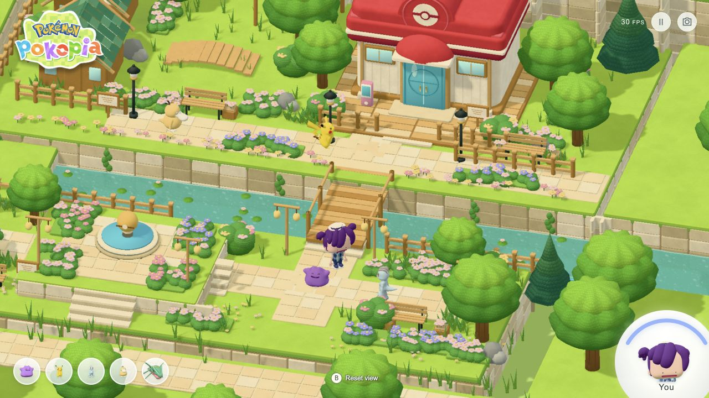

# Pokopia Town

An interactive, fan-made Pokémon town built with Three.js and authored in Blender. The scene includes a click-to-move protagonist, animated town residents, flowing water, a constrained isometric camera, and a 30 FPS render target.

**Live demo:** https://lersent001.github.io/pokepia-town/



## Features

- Click a walkable road or lawn to move the protagonist using A* navigation.
- Cross bridges and stairs with continuous elevation changes.
- Follow Ditto, Pikachu, Machop, Psyduck, Rayquaza, or the protagonist from the corner portraits.
- Animated residents roam naturally; Rayquaza follows an aerial route.
- Three.js Water2 provides reflective, refractive flow with shoreline foam.
- Orthographic camera limits keep the authored area in frame.
- English, Pokopia-inspired interface with a 30 FPS frame scheduler and adaptive pixel ratio.

## Controls

| Input | Action |
| --- | --- |
| Click | Move to a reachable point |
| Drag | Rotate the camera within the scene limits |
| Mouse wheel | Zoom |
| `B` or `Esc` | Reset the camera |
| `H` | Hide or show the interface |
| Pause button | Pause or resume the simulation |
| Camera button | Save a PNG screenshot |

## Run locally

Node.js 22.12 or newer is recommended.

```bash
npm install
npm run dev
```

Open http://127.0.0.1:5178/.

```bash
npm run build
npm run preview
```

The production build is written to `dist/`. GitHub Pages is deployed automatically from `.github/workflows/pages.yml` after a push to `main`.

## Blender sources

- `blender/build_player.py` generates the protagonist mesh, plaid texture, 15-bone rig, idle animation, and walk animation.
- `blender/build_town.py` generates the environment.
- `blender/rebuild_all.py` rebuilds and exports the complete scene through Blender MCP.
- `tools/sanitize_blend_paths.py` converts external resource paths in a local Blender file to repository-relative paths.

Generated `.blend` files are intentionally excluded from version control because Blender binaries can retain workstation paths. Run the source scripts locally to generate them. The web-ready GLB exports are included under `public/`.

The protagonist GLB contains 71,600 triangles, 15 bones, `Player_Idle`, and `Player_Walk`. Its head and hat occupy approximately 59% of the total height. Arms, wrists, palms, and fingers use fused surfaces and blended skin weights rather than visible ball joints.

## Verification

```bash
npm test
npm run build
```

The navigation tests cover bridge-only crossing, continuous elevation, garden stairs, water rejection, and building detours. A local 1280×720 production run measured 30 FPS at a 1.35 pixel ratio and completed a click-directed bridge crossing. Runtime performance varies by hardware and browser.

## Licensing and asset provenance

Project-authored source code and original project assets are licensed under the [MIT License](LICENSE). Third-party assets keep their own licenses and rights. See [THIRD_PARTY_NOTICES.md](THIRD_PARTY_NOTICES.md) for exact files, source URLs, pinned revisions, modifications, and exclusions.

The five Pokémon GLBs originate from the MIT-licensed `Pokemon-3D-api/assets` repository at a pinned commit. Pokémon characters, names, logos, and related intellectual property remain the property of their respective owners. The official Pokopia logo is included only for identification in this non-commercial fan demonstration and is not covered by this repository's MIT license.

This project is not affiliated with, endorsed by, or sponsored by Nintendo, The Pokémon Company, Creatures Inc., GAME FREAK inc., or KOEI TECMO GAMES.

## Contributing

Read [CONTRIBUTING.md](CONTRIBUTING.md) before opening a pull request. By contributing, you confirm that you have the right to submit the code or assets and that third-party material is documented.
